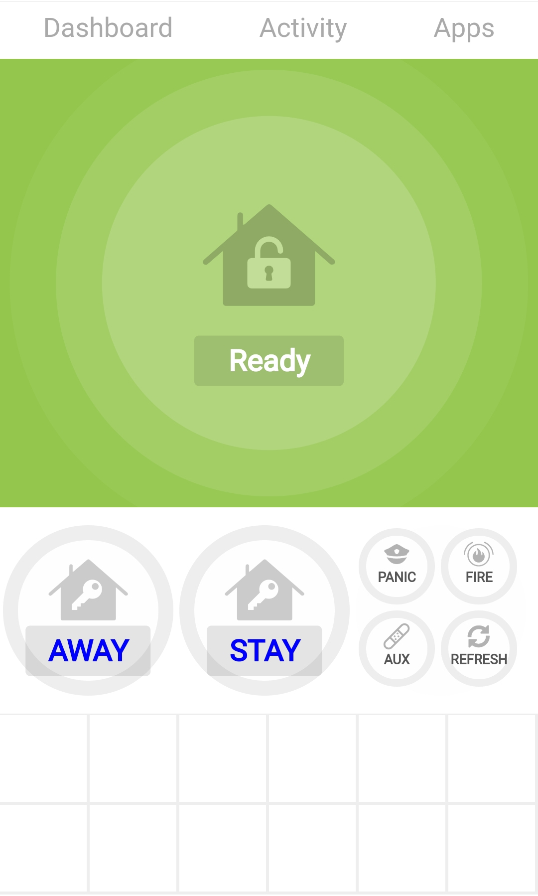
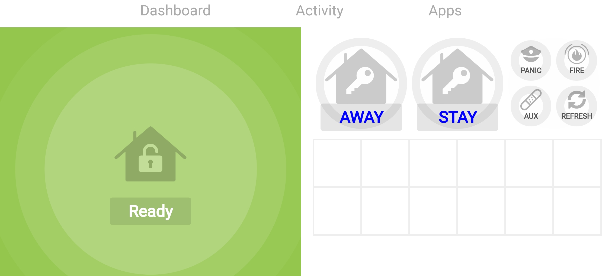
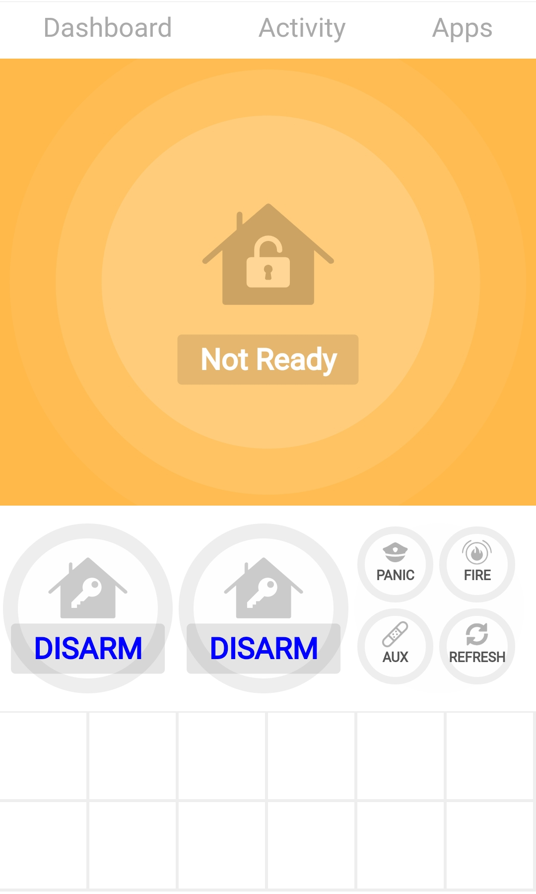
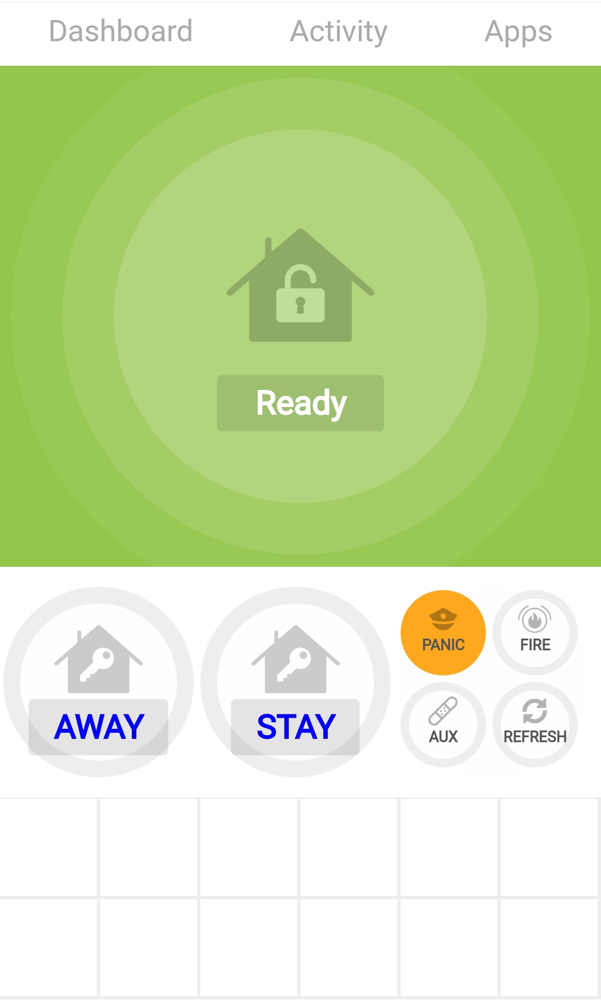
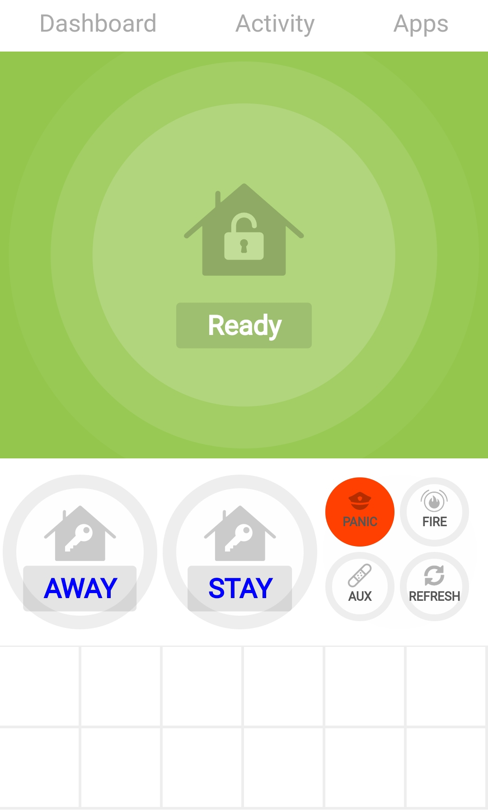
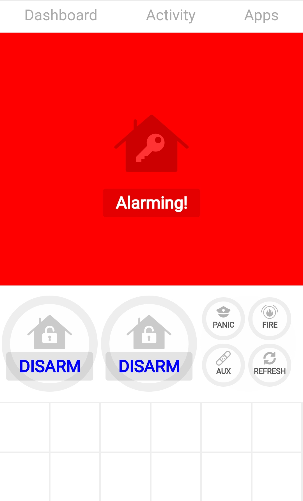
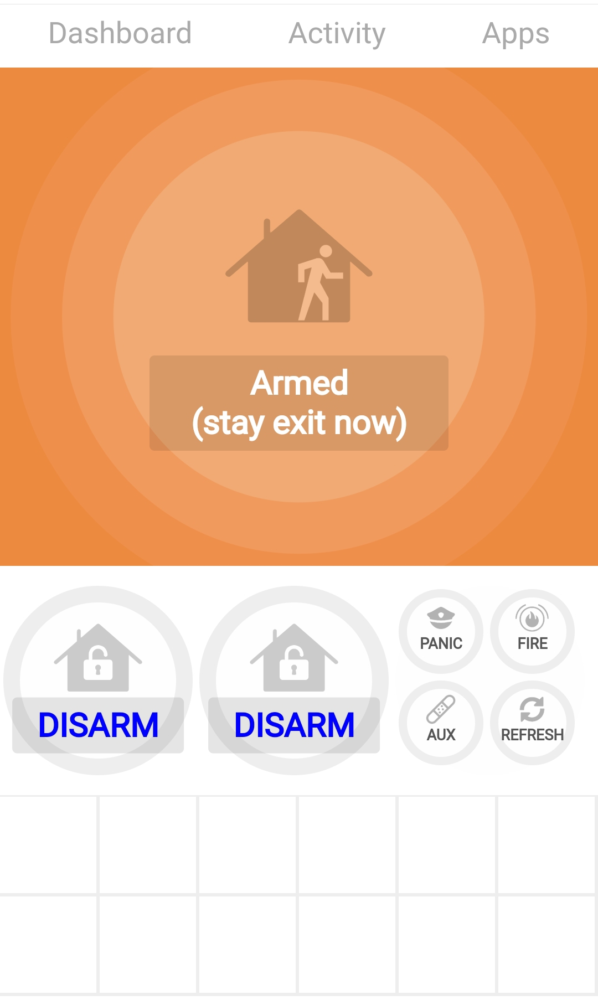
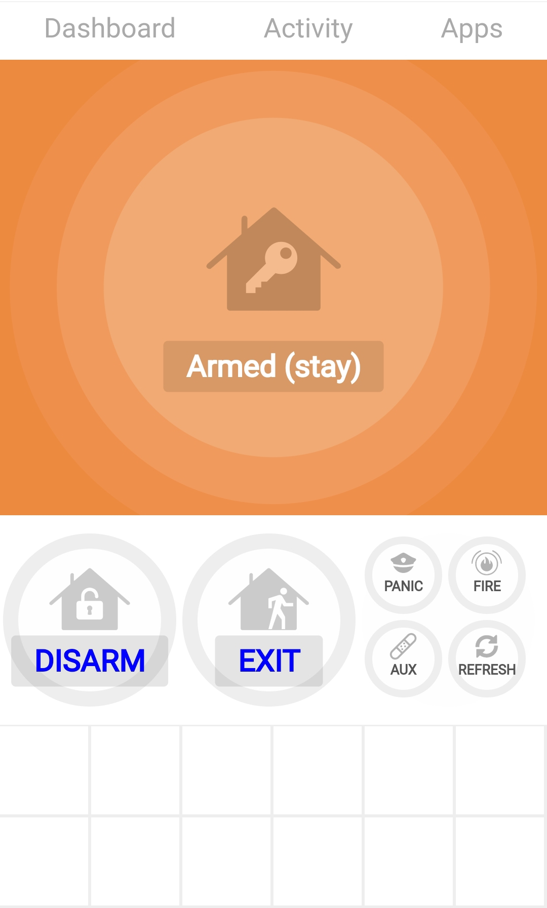

# HTML5 WebSocket based user interface app.html
<p>
</p>

## Setup.
Copy the contents of flash-drive folder into the root directory of a uSD flash drive formatted with a fat32 filesystem on a single MSDOS partition. Place this uSD flash drive into the ESP32-POE-ISO board and reboot.

To access the web interface connect to the IP address or host name of the ESP32-POE-ISO board that is configured with the 'webui' build of the AD2IoT firmware.

The dashboard provides live partition state, keypad display text, power/battery/chime/bypass indicators, active zones, quick arm/disarm controls, emergency controls, a reboot-scoped 64-event activity log, and a full `0-9`, `*`, `#` virtual keypad. The header shows the firmware version/build date, connection mode, and device IP. A read-only Settings pane shows runtime health, SD/SPIFFS state, the active configuration, both stored `ad2iot.ini` files, and recent device logs. Credential values and alarm codes are redacted on the device. Emergency controls retain the three-tap safeguard. The web assets have no internet dependencies.
## Arguments
- codeID : The codeid slot to use on the AD2IoT for arming etc.
- partID : The partition slot to use for this virtual keypad. If partition is configured for address 18 then this virtual keypad will show that keypads partition state.
- wsHost : To allow for easy development you can access the app.html using the browser file:///~/AlarmDecoder-IoT/contrib/webUI/flash-drive/app.html?partID=0&codeID=0&wsHost=192.168.0.20 so the websocket connection will be to the ESP32-POE-ISO board but html content from a local filesystem.

## Examples
-   http://192.168.0.1/app.html?partID=1&codeID=1
-   http://192.168.0.1/app.html
    - Defaults to PartID 0 and codeID 0

## Read-only HTTP API

- `GET /api/state?partition=0` returns the current state for a configured partition slot.
- `GET /api/history?limit=64` returns newest-first activity from the current boot session.
- `GET /api/history?limit=20&partition=1` optionally filters activity by the panel partition number.
- `GET /api/system` returns build, network, storage, memory, and device details.
- `GET /api/config?source=active|spiffs|sd` returns a redacted configuration snapshot as plain text.
- `GET /api/logs?limit=64` returns newest-first device logs from the current boot session.

Responses are JSON and use `Cache-Control: no-store`. The same webUI IP/CIDR ACL applies to the API and WebSocket endpoint.

## HTTPS and Let's Encrypt

HTTPS is opt-in and listens on port 443. Copy the actual PEM file contents (not Certbot symlinks) to `certs/fullchain.pem` and `certs/privkey.pem` on the FAT32 SD card, then configure and restart:

```ini
[webui]
enable = true
ssl = true
sslcert = certs/fullchain.pem
sslkey = certs/privkey.pem
```

Paths must remain beneath `/sdcard`. The private key must be unencrypted because the embedded server cannot prompt for a passphrase. Restart after certificate renewal so the new files are loaded. When HTTPS is enabled, missing or invalid PEM files prevent the Web UI from starting rather than exposing an HTTP fallback.

## WebSocket commands

- `!SYNC:<partID>,<codeID>` selects the configured partition and code slots and returns current state.
- `!HISTORY:<limit>` returns up to 64 retained activity items.
- `!PING:<value>` checks the connection.
- `!SEND:<AWAY>`, `<STAY>`, `<DISARM>`, `<EXIT>`, or `<CHIME>` invokes the corresponding control.
- `!SEND:<BYPASS><zone>` bypasses a valid zone.
- `!SEND:<KEYS><keys>` sends up to 32 validated keypad characters (`0-9`, `*`, and `#`).
- Emergency commands are `<PANIC_ALARM>`, `<FIRE_ALARM>`, and `<AUX_ALARM>`.

Control clients must send `SYNC` before `SEND`. Invalid frames receive an `!ERROR:` text response.

## Templates
Creating a file ex "index.html" with the same name but add .tpl extension ex "index.html.tpl" will cause
the web server code to process the file as a template.

The file can be zero length.

Enable template processing for index.html then upload the sketch data.
  \> touch index.html.tpl

### Template macros
```
 ${0}  - Device Version string
 ${1}  - Uptime string DDDDd:HHh:MMm:SSs
 ${2}  - This device ipv4 address HOST
 ${3}  - Web client ipv4 address
 ${4}  - Protocol [HTTP/HTTPS]
 ${5}  - Device UUID
 ${6}  -
 ${7}  -
 ${8}  -
 ${9}  -
 ${10} -
```

## Pre compressed files.
Files with .gz extension will be returned when the partial request file is used.
ex. /favicon.ico will be sent from favicon.ico.gz if it exists and the server
will inform the client on the stream being compressed data so it can decompress it.

## Examples







